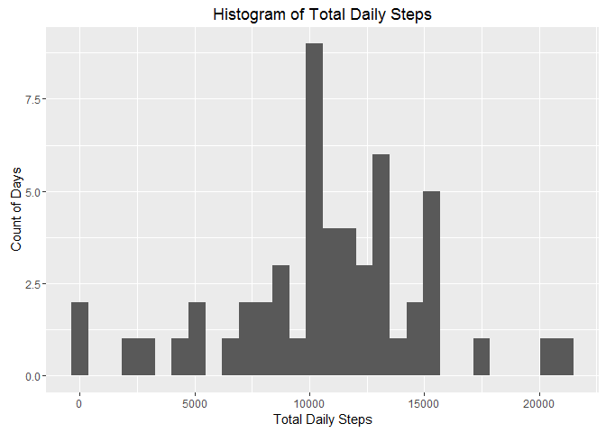
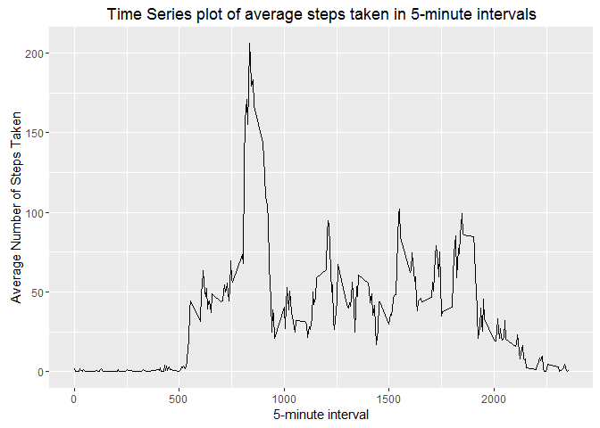
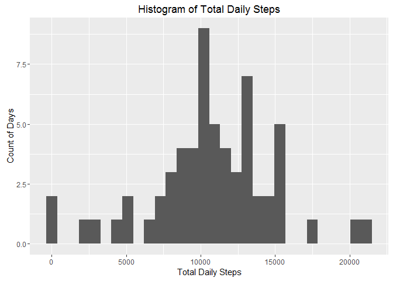

# Reproducible Research: Peer Assessment 1
Created by CharlieAlpha. Copyleft on March 25 2016

## Settings and Required Packages

```r
echo = TRUE  # Always make code visible
options(repos=c(CRAN="http://cran.us.r-project.org"))
library(ggplot2)
library(plyr)
library(lattice)
```

## Loading and processing the data
Process/transform the data (if necessary) into a format suitable for your analysis

```r
install.packages("downloader")
```

```
## package 'downloader' successfully unpacked and MD5 sums checked
## 
## The downloaded binary packages are in
## 	C:\Users\Christian\AppData\Local\Temp\RtmpQ5MXpv\downloaded_packages
```

```r
require(downloader)
```

```
## Loading required package: downloader
```

```r
url <- "https://d396qusza40orc.cloudfront.net/repdata%2Fdata%2Factivity.zip"
download(url, "activity.zip")
unzip("activity.zip")
subjectActivity = read.csv("activity.csv",colClasses=c("integer","Date","integer"))
```


## What is mean total number of steps taken per day?
For this part of the assignment, you can ignore the missing values in the dataset.

```r
subjectActivityClean <- na.omit(subjectActivity)
head(subjectActivityClean)
```

```
##     steps       date interval
## 289     0 2012-10-02        0
## 290     0 2012-10-02        5
## 291     0 2012-10-02       10
## 292     0 2012-10-02       15
## 293     0 2012-10-02       20
## 294     0 2012-10-02       25
```

1. Make a histogram of the total number of steps taken each day

```r
subjectActivityDailySteps<-ddply(subjectActivityClean, c("date"),summarise, steps=sum(steps))
DailyStepsHist<-ggplot(subjectActivityDailySteps,aes(x=steps))+geom_histogram()+
xlab("Total Daily Steps")+
ylab("Count of Days")+
ggtitle("Histogram of Total Daily Steps")
print(DailyStepsHist)
```

```
## `stat_bin()` using `bins = 30`. Pick better value with `binwidth`.
```



2. Calculate and report the mean and median total number of steps taken per day

Mean total number of steps taken per day:

```r
mean(subjectActivityDailySteps$steps)
```

```
## [1] 10766.19
```
Median total number of steps taken per day:

```r
median(subjectActivityDailySteps$steps)
```

```
## [1] 10765
```

## What is the average daily activity pattern?
1. Make a time series plot (i.e. type = "l") of the 5-minute interval (x-axis) and the average number of steps taken, averaged across all days (y-axis)

Aggreagte Average by 5 Min Interval

```r
subjectActivityIntervalSteps<-ddply(subjectActivityClean, c("interval"),summarise, steps=mean(steps))
head(subjectActivityIntervalSteps)
```

```
##   interval     steps
## 1        0 1.7169811
## 2        5 0.3396226
## 3       10 0.1320755
## 4       15 0.1509434
## 5       20 0.0754717
## 6       25 2.0943396
```

Plot the Time Series

```r
ggplot(subjectActivityIntervalSteps, aes(interval, steps)) + geom_line() + labs(title = "Time Series plot of average steps taken in 5-minute intervals", x = "5-minute interval", y = "Average Number of Steps Taken")
```




2. Which 5-minute interval, on average across all the days in the dataset, contains the maximum number of steps?

```r
subjectActivityIntervalSteps[subjectActivityIntervalSteps$steps == max(subjectActivityIntervalSteps$steps), ]
```

```
##     interval    steps
## 104      835 206.1698
```

## Imputing missing values
1. Calculate and report the total number of missing values in the dataset (i.e. the total number of rows with NAs) 

```r
sum(is.na(subjectActivity))
```

```
## [1] 2304
```

2. Devise a strategy for filling in all of the missing values in the dataset. The strategy does not need to be sophisticated. For example, you could use the mean/median for that day, or the mean for that 5-minute interval, etc. 

My strategy is to use a random sample from the clean dataset. This should be fairly sound and was a new challenge for me.

Copy Data to Impute, just in case you need it for later.

```r
subjectActivityI<- subjectActivity
head(subjectActivityI)
```

```
##   steps       date interval
## 1    NA 2012-10-01        0
## 2    NA 2012-10-01        5
## 3    NA 2012-10-01       10
## 4    NA 2012-10-01       15
## 5    NA 2012-10-01       20
## 6    NA 2012-10-01       25
```

3. Create a new dataset that is equal to the original dataset but with the missing data filled in. 

```r
set.seed(404);
subjectActivityI[is.na(subjectActivityI)] <- sample(subjectActivityClean$steps, sum(is.na(subjectActivityI)), replace=F)
head(subjectActivityI)
```

```
##   steps       date interval
## 1   131 2012-10-01        0
## 2    95 2012-10-01        5
## 3    37 2012-10-01       10
## 4     0 2012-10-01       15
## 5     0 2012-10-01       20
## 6     0 2012-10-01       25
```

4. Make a histogram of the total number of steps taken each day and Calculate and report the mean and median total number of steps taken per day. 

```r
subjectActivityDailyStepsI<-ddply(subjectActivityI, c("date"),summarise, steps=sum(steps))
head(subjectActivityDailyStepsI)
```

```
##         date steps
## 1 2012-10-01  9146
## 2 2012-10-02   126
## 3 2012-10-03 11352
## 4 2012-10-04 12116
## 5 2012-10-05 13294
## 6 2012-10-06 15420
```


```r
DailyStepsHistI<-ggplot(subjectActivityDailyStepsI,aes(x=steps))+geom_histogram()+
xlab("Total Daily Steps")+
ylab("Count of Days")+
ggtitle("Histogram of Total Daily Steps")
print(DailyStepsHistI)
```

```
## `stat_bin()` using `bins = 30`. Pick better value with `binwidth`.
```



Do these values differ from the estimates from the first part of the assignment? What is the impact of imputing missing data on the estimates of the total daily number of steps?

Mean total number of steps taken per day:

```r
mean(subjectActivityDailyStepsI$steps)
```

```
## [1] 10707.07
```
Median total number of steps taken per day:

```r
median(subjectActivityDailyStepsI$steps)
```

```
## [1] 10600
```
Compare them with the two before imputing missing data:

```r
mean(subjectActivityDailySteps$steps)-mean(subjectActivityDailyStepsI$steps)
```

```
## [1] 59.12311
```

```r
median(subjectActivityDailySteps$steps)-median(subjectActivityDailyStepsI$steps)
```

```
## [1] 165
```
Yes, there is a difference.

## Are there differences in activity patterns between weekdays and weekends?

For this part the weekdays() function may be of some help here. Use the dataset with the filled-in missing values for this part.

1. Create a new factor variable in the dataset with two levels - "weekday" and "weekend" indicating whether a given date is a weekday or weekend day

Add Day of the Week

```r
subjectActivityI$dayOfWeekLevel <-factor(format(subjectActivityI$date, "%A"))
head(subjectActivityI)
```

```
##   steps       date interval dayOfWeekLevel
## 1   131 2012-10-01        0         Monday
## 2    95 2012-10-01        5         Monday
## 3    37 2012-10-01       10         Monday
## 4     0 2012-10-01       15         Monday
## 5     0 2012-10-01       20         Monday
## 6     0 2012-10-01       25         Monday
```

Convert Day of the Week to Weekday or Weekend level

```r
levels(subjectActivityI$dayOfWeekLevel) <- list(weekday = c("Monday", "Tuesday", "Wednesday", "Thursday", "Friday"), weekend = c("Saturday", "Sunday"))
head(subjectActivityI)
```

```
##   steps       date interval dayOfWeekLevel
## 1   131 2012-10-01        0        weekday
## 2    95 2012-10-01        5        weekday
## 3    37 2012-10-01       10        weekday
## 4     0 2012-10-01       15        weekday
## 5     0 2012-10-01       20        weekday
## 6     0 2012-10-01       25        weekday
```

2. Make a panel plot containing a time series plot (i.e. type = "l") of the 5-minute interval (x-axis) and the average number of steps taken, averaged across all weekday days or weekend days (y-axis). The plot should look something like the following, which was creating using simulated data:

Average Imputed Data by 5 Min Invervals and Plot

```r
subjectActivityIntervalStepsI<-ddply(subjectActivityI, c("interval","dayOfWeekLevel"),summarise, steps=mean(steps))

xyplot(subjectActivityIntervalStepsI$steps ~ subjectActivityIntervalStepsI$interval | subjectActivityIntervalStepsI$dayOfWeekLevel, 
layout = c(1, 2), type = "l", xlab = "5-minute interval", ylab = "Average Number of Steps Taken")
```


